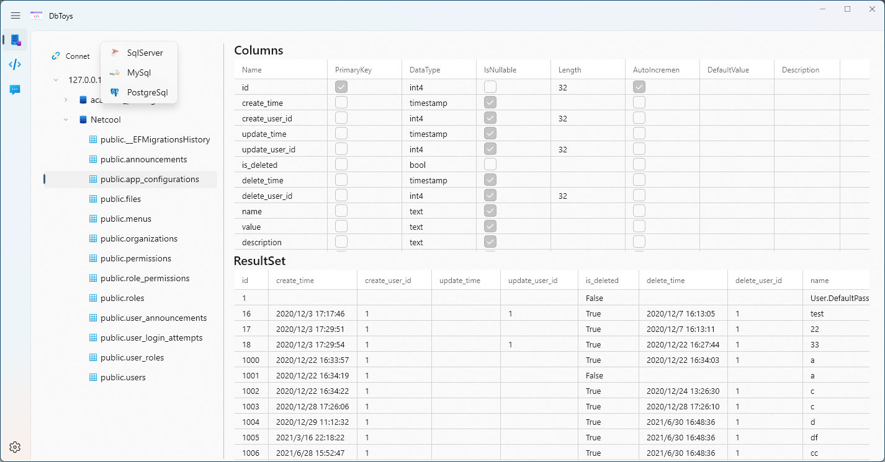
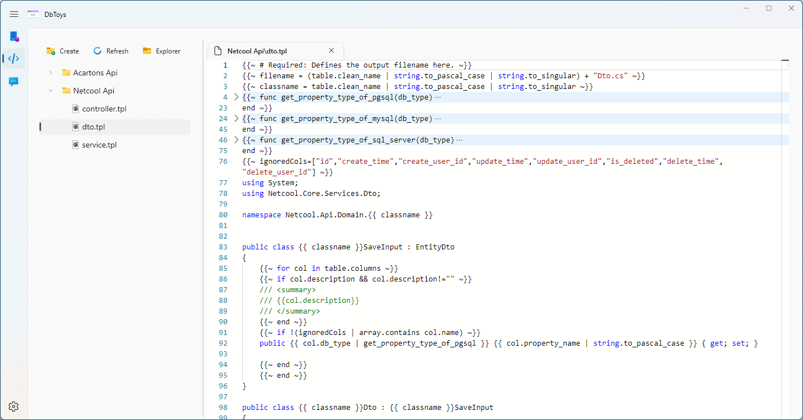

# DbToys 

# Introduction

DbToys offers a set of utilities around database like view table design, exporting data dictionary, code generator.

Supported databases:
 - Sql Server
 - Mysql
 - Postgresql

 Features:
- Database
	+ View table design
	+ View Sample result data of table
	+ Export data dictionary to excel
	+ Code generation
- Code Templates
	+ Read/Create/Delete/Rename code templates
	+ Open template folder to explorer.

# Next Steps

- Code Templates
	+ define global template variable
- Code Generation
	+ inject custom context variable 

# How to install

## Prerequisite
* You need Windows 10 build 17763+ or later.
* [Microsoft Edge WebView2 Runtime](https://go.microsoft.com/fwlink/p/?LinkId=2124703) should be installed.

## Via Microsoft Store
[DbToys](https://apps.microsoft.com/store/detail/dbtoys/9NKCGCMR2W99)

## Via Release
Go to [GitHub releases page](https://github.com/NeilQ/DbToys/releases), click on Assets at the bottom to show the files available in the release.
**(Cannot autoupdate)**

# Known issues
* [Flash when using Multiple WebViews in Tab Controls](https://github.com/MicrosoftEdge/WebView2Feedback/issues/1412)
* [WinUI3 WebView2 mouse stop working while keyboard is still working.](https://github.com/MicrosoftEdge/WebView2Feedback/issues/3003#issuecomment-1407131599)
* [TreeView with DataTemplateSelector not reliably using selected DataTemplate](https://github.com/microsoft/microsoft-ui-xaml/issues/2121)

